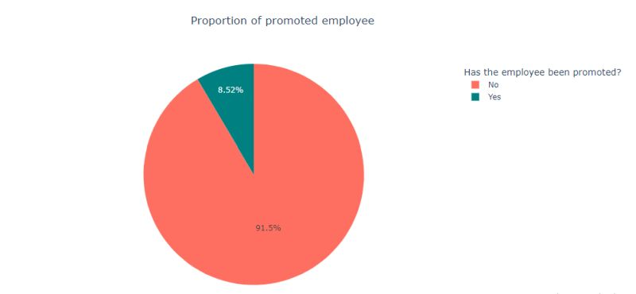
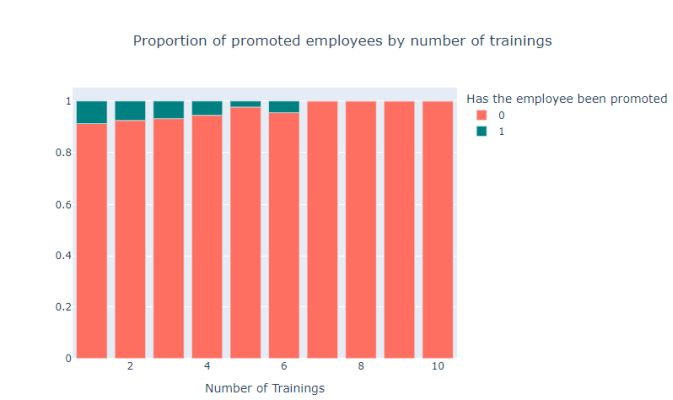
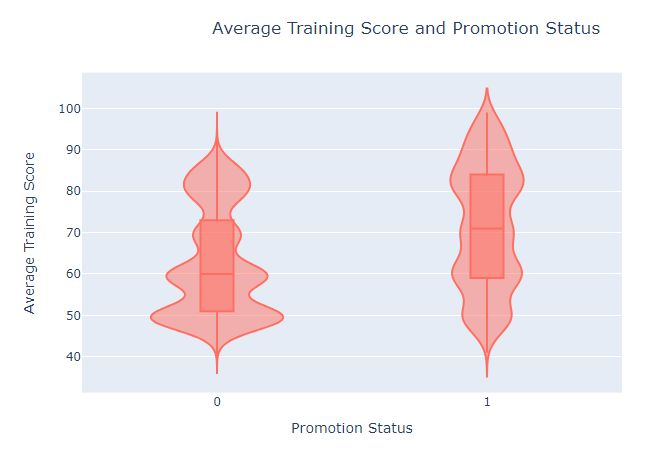

<h1>Employee Status Prediction Web App</h1> 

<h3>Best Techniques and Metrics for Imbalanced Dataset</h3>
<h4>"A classifier is only as good as the metric used to evaluate it" - Jason Brownlee</h4>

You can view the live demo <a href="https://oyebamiji-micheal-employee-status-prediction-web-app.streamlit.app/">here.</a>

 

<h2>Table of Contents</h2>

- [Overview](#overview)
- [Objective](#objective)
- [Insights from EDA](#insights)
- [Feature Engineering (Summary)](#feature_engineering)
- [Precision-Recall Dilemma](#dilemma)
- [Techniques for Class Imbalanced](#techniques)
- [Models and Evaluation Metrics](#model)
- [Model Selection - Conclusion](#conclusion)
- [Resources and References](#reference)

<h2>Overview</h2>

Classification, a fundamental task in machine learning, involves predicting categories or labels for data points. In this project, I'll be taking on a classification task which involves predicting whether an employee will be promoted or not based on a range of features. What makes this task fun and challenging is its additional layer of complexity courtesy of a highly imbalanced dataset. My goal here is to learn/apply the best techniques when it comes to imbalanced datasets and compare how they impact relevant model metrics.

<h2>Objective</h2>

I have tried painting this as a real-world instance in which my assignment is to develop a robust employee promotion prediction model while addressing the challenges an imbalanced dataset poses. To achieve this, I'll pursue the following goals:

- 
<strong>Exploratory Data Analysis (EDA):</strong> Conduct a thorough exploration of the dataset to uncover patterns, trends, and potential insights. The purpose of EDA is to help understand the distribution of features, identify potential outliers, and gather preliminary information about feature relevance.

- 
<strong>Handling Imbalanced Data:</strong> Imbalanced datasets can lead to biased model outcomes. Also, classification common metrics such as accuracy might not be the best metric for model performance with respect to an imbalanced dataset. In the notebook, I explored various techniques to handle this imbalance, such as oversampling, undersampling, and using specialized algorithms designed for imbalanced data.

<h2>Insights from EDA</h2>

The dataset contains about 54,000 rows and 14 columns. The CSV file, along with the column description, can be found on <a href="https://www.kaggle.com/datasets/shivan118/hranalysis">Kaggle</a>. Below are some of the insights gained after performing an EDA. 

- As pointed out earlier, the data is highly imbalanced. Below is the proportion of employees who are promoted to those who are not.

- While males constitute a larger portion of the workforce (about 60%), 8.9% of females have successfully earned promotions which are higher than that of males, 8.3%.
  
- The `number_of_training` column contains ten unique values (1-10) which represents an employee's total number of trainings. Part of my EDA was to see how this column relate to whether an employee gets promoted or not. The plot below shows the proportion of employees across each unique `number_of_training`. Moving from left to right, we observe that the proportion of promoted employees decreases as the respective `number_of_training` increases - a negative correlation. 

- A positive correlation was observed between the number of promoted employees and previous year rating. 

- The violin plot below shows that promoted employees on average have a higher `average_training_score`. Another observation was that an `average_training_score` of 60 seem like a benchmark for promotion. This observation is roughly true if we consider non promoted employees. Most non promoted employees have an `average_training_score` of 50 as shown by the larger width of the violin plot. To further back this, just 25% of promoted employees have less than an `average_training_score` of 60. 

<h2>Feature Engineering</h2>
Below is a summary of the data preprocessing and feature engineering I have carried out

- 
Outliers: I have decided not to drop 'outliers' in this case for two reasons. First, the dataset already contains very little positive class and second, the range of values in the columns is not too far apart. For example, all numeric columns in the data roughly range from 1 to 99.

- Missing Values: Only two columns contain missing values - `education` and `previous_year_rating`. All NANs in `education` were replace with the word 'unknown' and 'zero' in `previous_year_rating`.  

- Encoding: Columns in which order counts were ordinal-encoded while the reverse were one-hot-encoded. This is because ML algorithms will assume that two nearby values are more similar than two distant values in the case of ordinal encoding. 

<h2>Precision-Recall Dilemma</h2>

A crossroad I find myself is choosing whether to optimize for precision or recall. FN in this task is interpreted as predicting an employee won't be promoted (negative), but in reality, they are promoted (positive). FP is interpreted as predicting an employee will be promoted, but in reality, they are not promoted. Optimizing for precision means we want to avoid false positives as much as possible while optimizing for recall means we want to avoid false negatives as much as possible. Both have their pros and cons and since there are no business metrics here, I have chosen to go with F1-Score (combination of precision and recall). 

<h2>Techniques for Class Imbalanced</h2>

 
Below are all of the techniques applied in the notebook

- Random Oversampling: This involves randomly duplicating examples from the minority class and adding them to the training dataset.

- SMOTE (Synthetic Minority Oversampling Technique): SMOTE works by selecting examples that are close in the feature space, drawing a line between the examples in the feature space and drawing a new sample at a point along that line.

- SMOTE + Tomek links: A combination of over-sampling the minority class and under-sampling the majority class.

- Class Weights: Control the balance of positive and negative weights

I have decided not to include undersampling techniques such as 'random undersampling' and 'undersampling using Tomek Links' due to the drastic reduction in the number of samples and poor performance.

<h2>Models and Evaluation Metrics</h2>

Three different algorithms were used in the notebook: Logistic Regression, Random Forest, and XGBoost. Below are the performance comparison of the base model (without any sampling technique)

<table border=1>
  <tr>
    <th>Model</th>
    <th>Accuracy</th>
    <th>Precision</th>
    <th>Recall</th>
    <th>F1 Score</th>
  </tr>
  <tr>
    <td>XGBoost</td>
    <td>0.942438</td>
    <td>0.887955</td>
    <td>0.349119</td>
    <td>0.501186</td>
  </tr>
  <tr>
    <td>Random Forest</td>
    <td>0.935504</td>
    <td>0.817035</td>
    <td>0.285242</td>
    <td>0.422857</td>
  </tr>
  <tr>
    <td>Tunned Random Forest</td>
    <td>0.931034</td>
    <td>0.969136</td>
    <td>0.172907</td>
    <td>0.293458</td>
  </tr>
  <tr>
    <td>Logistic Regression</td>
    <td>0.921091</td>
    <td>0.586345</td>
    <td>0.160793</td>
    <td>0.252377</td>
  </tr>
</table>

 

The performance of tree-based algorithms such as Random Forest, lightGBM, and XGBoost especially are generally not affected by imbalanced data due to their averaging nature. This is not supreme, however. There are cases when they perform poorly on imbalanced data.  

I have decided to choose Random Forest as my base comparison model in order to see how different sampling techniques affect relevant metrics. Below is how the different sampling techniques compare

<table border="1">
  <tr>
    <th>Random Forest with</th>
    <th>Accuracy</th>
    <th>Precision</th>
    <th>Recall</th>
    <th>F1 Score</th>
  </tr>
  <tr>
    <td>Random Oversampling</td>
    <td>0.929028</td>
    <td>0.626459</td>
    <td>0.354626</td>
    <td>0.452883</td>
  </tr>
  <tr>
    <td>No Under/Oversampling</td>
    <td>0.937694</td>
    <td>0.841945</td>
    <td>0.305066</td>
    <td>0.447858</td>
  </tr>
  <tr>
    <td>SMOTE Oversampling</td>
    <td>0.933224</td>
    <td>0.716749</td>
    <td>0.320485</td>
    <td>0.442922</td>
  </tr>
  <tr>
    <td>Class Weight</td>
    <td>0.937238</td>
    <td>0.845912</td>
    <td>0.296256</td>
    <td>0.438825</td>
  </tr>
  <tr>
    <td>SMOTE + Tomek</td>
    <td>0.932129</td>
    <td>0.705000</td>
    <td>0.310573</td>
    <td>0.431193</td>
  </tr>
</table>

<h2>Model Selection - Conclusion</h2>
There is no guarantee a particular sampling method will always perform better. The question of which model performed best or better is actually subjective and it depends on organization goals and likely consequences.

<strong>Optimizing for precision might result in </strong> 

- Missing out on promoting a deserving employee can lead to demotivation, decreased job satisfaction, and potentially higher turnover.

- Loss of talented employees who may seek better opportunities elsewhere.  

<strong>Optimizing for recall might result in </strong> 

- Promoting an employee who isn't ready for the new role could lead to underperformance and dissatisfaction in the new position.

- Misallocation of resources, as promotions require investments in training and development.

My aim for this project is not channeled to any business plan but rather to gain experience on the different techniques used for imbalanced data. 
<h2>Resources and References</h2>

- <a href="https://machinelearningmastery.com/tour-of-evaluation-metrics-for-imbalanced-classification/">Tour of Evaluation Metrics for Imbalanced Classification</a>
  
- <a href="https://www.kaggle.com/code/marcinrutecki/best-techniques-and-metrics-for-imbalanced-dataset/notebook">Best techniques and metrics for Imbalanced Dataset</a>

- <a href="https://machinelearningmastery.com/random-oversampling-and-undersampling-for-imbalanced-classification/">Random Oversampling and Undersampling for Imbalanced Classification</a>
